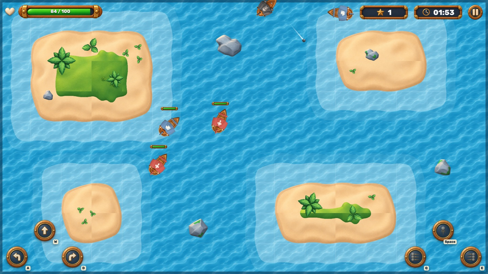
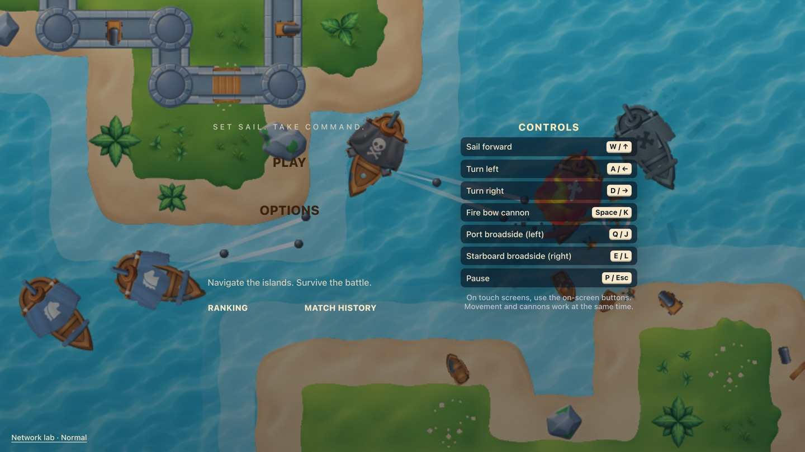
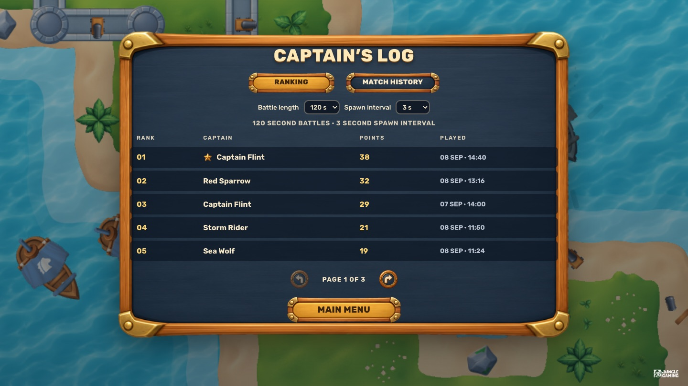
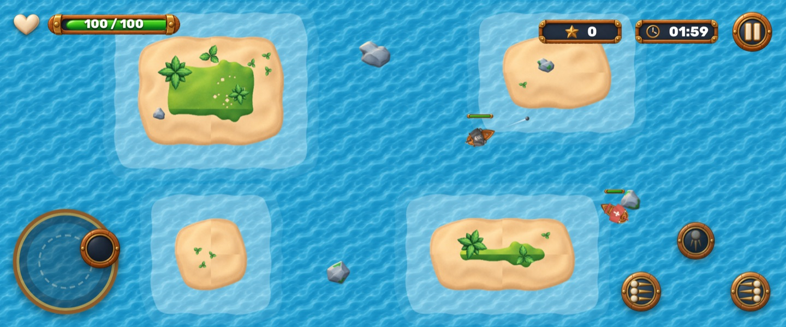

# Pirate Battle

A top-down 2D naval shooter built with **React 19**, **TypeScript (strict)** and **PixiJS 8**. Sail between islands, sink enemy ships and score as many points as you can before the battle ends. The ranking and match history use a REST API simulated with **MSW**, consumed through **Axios** and **TanStack Query**.



| Main menu | Captain's Log (ranking) | Mobile (landscape) |
| --- | --- | --- |
|  |  |  |

> Design decisions are explained in [ARCHITECTURE.md](ARCHITECTURE.md). The original challenge brief (in Portuguese) is kept in [docs/CHALLENGE.md](docs/CHALLENGE.md).

## Contents

- [Stack](#stack)
- [Getting started](#getting-started)
- [Commands](#commands)
- [Environment variables](#environment-variables)
- [Controls](#controls)
- [Match rules](#match-rules)
- [Gameplay configuration](#gameplay-configuration)
- [Ranking and match history](#ranking-and-match-history)
- [Network scenarios (MSW)](#network-scenarios-msw)
- [Reproducing failures](#reproducing-failures)
- [Testing](#testing)
- [Project structure](#project-structure)
- [Local persistence](#local-persistence)
- [Accessibility and responsiveness](#accessibility-and-responsiveness)
- [Deployment](#deployment)
- [Credits and licenses](#credits-and-licenses)
- [Known limitations](#known-limitations)

## Stack

| Responsibility | Technology |
| --- | --- |
| UI, menus and dialogs | React 19 |
| Language | TypeScript 6 (`strict`, `noUncheckedIndexedAccess`) |
| Game rendering | PixiJS 8 (WebGL) |
| Remote state (ranking/history) | TanStack Query 5 |
| HTTP client | Axios |
| API mocking | MSW 3 (Service Worker, also in the production build) |
| E2E and visual regression tests | Playwright |
| Simulation unit tests | Vitest |
| Build tool | Vite 8 |
| Font | Rubik (via `@fontsource`) |

## Getting started

Requirements: **Node.js ≥ 20.19** (developed with Node 24) and **npm**.

```bash
npm install
```

```bash
npm run dev
```

Open http://localhost:5173. MSW starts with the app, so there is no backend to set up.

To run the E2E tests, install Playwright's Chromium once:

```bash
npx playwright install chromium
```

## Commands

| Command | What it does |
| --- | --- |
| `npm run dev` | Development server (Vite) on `:5173` |
| `npm run build` | Type check + production build into `dist/` |
| `npm run preview` | Serves the production build on `:4173` |
| `npm run lint` | ESLint (TypeScript, React Hooks) |
| `npm run typecheck` | `tsc -b` across all TypeScript projects |
| `npm run test:unit` | Simulation unit tests (Vitest) |
| `npm run test:e2e` | Build + preview + Playwright suite (desktop and mobile) |
| `npm run test:e2e:ui` | Playwright in interactive mode |
| `npm run test:e2e:update` | Regenerates the visual regression baselines |
| `npm run test:e2e:report` | Opens the HTML report in `reports/playwright` |
| `npm run perf` | Profiles the production build: 3-minute stress match and 5 play/exit memory cycles (writes `reports/perf/`) |
| `npm run balance` | Plays matches with a bot and prints score/survival stats |
| `npm run check` | `lint` + `typecheck` + `test:unit` |

## Environment variables

All of them are optional. See [.env.example](.env.example).

| Variable | Default | Description |
| --- | --- | --- |
| `VITE_API_TIMEOUT_MS` | `8000` | Timeout of ranking/history requests (Axios) |
| `VITE_API_BASE_URL` | `''` | API base URL. Empty = same origin, served by MSW |
| `VITE_ENABLE_MOCKS` | `true` | `false` disables MSW (only useful with a real API) |
| `E2E_BASE_URL` | — | Runs Playwright against an already running URL instead of starting the preview |

## Controls

| Action | Keyboard | Touch devices (phones, tablets) | Mouse / desktop pad |
| --- | --- | --- | --- |
| Steer | `A`/`←` and `D`/`→` turn, `W`/`↑` sails forward | **Joystick** (bottom left): drag towards where you want to sail | ↰ ⬆ ↱ buttons (bottom left) |
| Bow cannon (1 cannonball) | `Space` / `K` | middle cannon button (bottom right) | same |
| Port broadside (3 cannonballs, left) | `Q` / `J` | ⋮◂ button | same |
| Starboard broadside (3 cannonballs, right) | `E` / `L` | ▸⋮ button | same |
| Pause / resume | `P` / `Esc` | pause button in the HUD | same |

- **Joystick.** The ship turns towards the stick direction at its normal turn rate and sails with thrust proportional to the deflection. A small dead zone ignores accidental touches. The ship still only sails forward and turns, so the rules are the same as with the keyboard. When the stick points behind the ship, thrust drops while the bow comes round, so it turns tightly instead of drawing a wide arc.
- Moving and firing work at the same time (several keys or several fingers).
- Holding a fire button shoots whenever that weapon's cooldown allows it.
- The joystick replaces the movement buttons automatically on touch-first devices (`pointer: coarse`); desktop keeps the buttons.
- Game keys are only captured while a match is running and no dialog is open.
- The controls are shown on the main menu, in the pause dialog and as key hints on the desktop buttons.

## Match rules

- Match length is configurable between **60 and 180 s** of active play (pauses do not count).
- Enemies appear every configured interval, on free water at least **700 units** away from the player (if the sea is crowded, a fallback accepts the farthest free point, never closer than ~495 units). The first two are always a **Chaser** and then a **Shooter**, so both types show up in every standard match.
- **Chaser:** hunts the player (going around islands with A\*) and explodes on contact, dealing damage. This self-destruction **does not score**.
- **Shooter:** closes in, holds a safe distance, aims with target leading and fires when the player is in range with a clear line of fire.
- Every enemy sunk by the player's cannons is worth **1 point**.
- The match ends when time runs out (**Time up**) or the player's health reaches zero (**Defeated**). From then on, movement, attacks, damage, spawns and scoring all stop.
- Pause is manual or automatic (window loses focus, tab hidden, or phone in portrait). Resuming always requires a player action, and keys held during the pause are ignored until pressed again.
- Reloading the page or leaving the combat screen abandons the match, which is never recorded.

## Gameplay configuration

Every parameter lives in one typed configuration: [`src/game/config/gameConfig.ts`](src/game/config/gameConfig.ts). Systems only read a **frozen snapshot** created when each match starts, so option changes apply to the next match.

**Player options** (Options screen, persisted in `localStorage`):

| Option | Limits | Default |
| --- | --- | --- |
| Game session time | 60–180 s, whole seconds (the −/+ buttons move in steps of 10) | 120 s |
| Enemy spawn time | 1–10 s, in 0.5 s steps (always positive) | 3 s |
| Captain name | 2–20 characters (letters, digits, space, `. _ - '`) | Captain Jack |
| Sound effects | on/off | on |

**Balancing** (world units; the arena is 2048 × 1152 and one tile is 128):

| Parameter | Player | Chaser | Shooter |
| --- | --- | --- | --- |
| Health | 100 | 40 | 60 |
| Max speed (u/s) | 210 (accel. 320, decel. 240) | 150 | 125 |
| Turn rate (rad/s) | 2.5 | 2.0 | 1.7 |
| Attack | Bow: 20 damage, 720 u/s, range 720, 0.45 s cooldown. Broadside: 3 × 20 damage, 620 u/s, range 460, 1.2 s cooldown per side | Ram: 15 damage | Cannon: 8 damage, 520 u/s, range 620, 2.2 s cooldown. Opens fire at 560 u, holds at 380 u |

Spawns: first enemy at 1.5 s, 55% Chaser / 45% Shooter, at most 10 enemies alive, and a 1 s grace period (no attacks) after spawning. The simulation runs in fixed 1/60 s steps and catches up at most 0.25 s per frame.

**Balancing decisions.** The numbers were tuned with `npm run balance`, which plays 12 matches per configuration with a simple bot (aims at the closest enemy, never dodges). Current results:

| Configuration | Average score | Matches survived |
| --- | --- | --- |
| 120 s / 3 s (default) | 24.2 | 1/12 (the others end between 54 s and 107 s) |
| 180 s / 1 s (hardest) | 11.6 | 0/12 |
| 60 s / 10 s (easiest) | 5.4 | 12/12 |

The default should be tough for a passive player but beatable by someone who uses broadsides and keeps moving. In the first version the bot sank after about 50 s. The Chaser's ram damage was lowered from 25 to 15 and its speed from 165 to 150. The Shooter now fires every 2.2 s (was 1.8 s) for 8 damage (was 10). The cap on living enemies went from 14 to 10.

## Ranking and match history

Typed contracts live in [`src/api/contracts.ts`](src/api/contracts.ts) and are shared by the client and the MSW handlers.

| Method | Route | Description |
| --- | --- | --- |
| `GET` | `/api/ranking?sessionTime&spawnInterval&page&pageSize` | Paginated ranking of matches played with **the same configuration** |
| `GET` | `/api/players/:playerId/matches?page&pageSize` | Paginated history of a player (newest first) |
| `POST` | `/api/matches` | Records a finished match (idempotent by `matchId`) |

- **Record fields:** `matchId`, `playerId`, `playerName`, `playedAt`, `score`, `durationMs` (effective play time), `endReason` (`time_up` \| `defeated`) and `config` (session time and spawn interval).
- **Deterministic tie-break:** higher score → longer effective duration (survived longer) → played earlier → `matchId`.
- **Idempotency:** the client generates `matchId` and also sends it as `Idempotency-Key`. Re-sending the same record returns `200` with the stored record (`created: false`), never a duplicate. The same `matchId` with different data returns `409`.
- **Pending records:** when a match ends, it is saved to `localStorage` (result + outbox) **before** any request. A worker built on `useMutation` drains the outbox and retries transient errors (timeout, network, 5xx, 408/429) with backoff. It tries again when the connection comes back, when the network scenario changes and every 15 s, and every stored record (even a rejected one) is re-sent when the app is opened again. Only answers that mean the record itself is invalid (`400`, `409`, `413`, `422`) are marked "rejected" until the player presses **Retry**. Anything else, including a `404`, is treated as transient. The player can start another match while records are pending.
- **Mock availability:** MSW keeps the list of mocked pages in the Service Worker's memory, and browsers stop idle workers (for example while the tab sits in the background). Before every request the client re-sends `MOCK_ACTIVATE` to the worker and waits for its confirmation. Every mocked response carries an `x-pirate-mock` header. A response without it reached the hosting server instead of the mock (on Vercel that is a `404` for `/api/*`), so it is reported as a transient network error and never rejects a record.
- **Cache and refresh:** queries use `placeholderData` to paginate without flicker and `refetchOnMount: 'always'` to refresh when a tab is shown again. Both tabs are invalidated after every confirmed record.
- **Late responses:** every page and configuration has its own cache key, and superseded requests are aborted with an `AbortSignal`. Every response also carries a monotonic `revision`, and a response older than the cached one is discarded.
- **Failures never block the game:** the API only affects the Ranking and Match History tabs and the record status on the result screen.

## Network scenarios (MSW)

The handlers live in [`src/mocks/handlers.ts`](src/mocks/handlers.ts) and are the same in development, in tests and in the published build. Confirmed records are stored in a mock database in `localStorage`, so they survive a refresh and stay consistent across both tabs.

**Selecting a scenario** (either way works):

1. In the main menu footer, click **Network lab** and pick a scenario. The choice is saved in `localStorage`.
2. Open the app with `?scenario=<id>`, for example `http://localhost:5173/?scenario=offline`.

**Restoring the initial state:** Network lab → **Reset to initial state**. This switches back to `normal`, recreates the fixtures, clears the pending outbox and the last result, and empties the TanStack Query cache.

| `id` | Name | Behavior |
| --- | --- | --- |
| `normal` | Normal | Success with 120–350 ms latency and rival captains (fixtures) |
| `empty` | Empty lists | Hides the fixtures: only your own matches are listed |
| `many-pages` | Many pages | +120 seeded matches (27 pages in the default ranking) |
| `slow` | Slow network | Every response takes 2.5 s |
| `variable-latency` | Variable latency | Seeded latency between 0.1 and 3 s |
| `out-of-order` | Out-of-order responses | Odd requests take 1.5 s, even ones 0.1 s |
| `timeout` | Timeout | The API never answers; the client times out |
| `network-error` | Connection failure | Every request fails at the network level |
| `server-error` | HTTP 500 | Every request returns 500 |
| `client-error` | HTTP 4xx | Queries return 400 and match registration returns 422 |
| `ranking-error` | Ranking fails | Ranking returns 503; history keeps working |
| `history-error` | History fails | History returns 500; ranking keeps working |
| `submit-timeout` | Timeout after registering | The first `POST` of a match is stored, then times out |
| `offline` | Unavailable at match end | The API is down; switch back to `normal` to recover pending records |

Randomness (latency and generated fixtures) comes from a seeded PRNG. In tests, latency and seed are pinned through `window.__PIRATE_TEST__` (`mockLatencyMs`, `mockSeed`).

## Reproducing failures

**Pending record after an outage**
1. Network lab → **Unavailable at match end**.
2. Play a match to the end. The result screen shows *Could not record the battle yet*.
3. Reload the page. The result and the pending record are still there, and the menu shows a banner with **Retry now**.
4. Network lab → **Normal**. The record is sent automatically and shows up exactly once in Ranking and Match History.

**Timeout after registering (no duplicates)**
1. Network lab → **Timeout after registering**. To see it sooner, run `VITE_API_TIMEOUT_MS=2000 npm run dev`.
2. Finish a match. The first request is stored on the server but times out. The retry receives the existing record and the status becomes *recorded*. Match History shows a single row.

**Out-of-order responses**
1. Network lab → **Out-of-order responses**.
2. Open Ranking and, while it loads, change *Battle length* and *Spawn interval*. The slow, older response arrives later but never replaces the table for the current configuration.

**Query errors:** pick **Ranking fails**, **History fails**, **HTTP 500**, **HTTP 4xx**, **Timeout** or **Connection failure** and open the tabs. You get accessible messages (`role="alert"`) with **Try again**, and the game stays playable.

**Asset loading failure:** in DevTools, *Network → Request blocking*, block `*tiles_sheet_retina*` and press **Play**. The error overlay offers **Retry**; unblock the request and try again. The tests do the same through MSW with `window.__PIRATE_TEST__.assetFailure`.

## Testing

### Unit tests (Vitest)

`npm run test:unit` covers the pure simulation: movement, arena bounds, island collision, cooldowns, the triple broadside, time-up and defeat endings, spawning both enemy types, Chaser rams that do not score, and determinism for a given seed.

### E2E (Playwright)

`npm run test:e2e` builds the app, starts `vite preview` and runs the suite in two projects: **desktop-chromium** (1280×720) and **mobile-chromium** (Pixel 7 landscape, touch enabled). Every test gets a fresh browser context, with its own `localStorage`, Service Worker and mock database.

| Challenge area | File |
| --- | --- |
| 1. Options navigation, validation and persistence | `e2e/options.spec.ts` |
| 2. Asset loading, failure and retry | `e2e/assets.spec.ts` |
| 3. Movement, rotation, arena bounds and islands | `e2e/movement.spec.ts` |
| 4. Bow and broadside fire, damage, cooldown and scoring | `e2e/combat.spec.ts` |
| 5. Chaser, Shooter and spawn interval | `e2e/enemies.spec.ts` |
| 6. Time-up and defeat, frozen simulation and clean restart | `e2e/match.spec.ts` |
| 7. Pause, focus loss and resume | `e2e/pause.spec.ts` |
| 8. Result screen and persistence after refresh | `e2e/result.spec.ts` |
| 9. Abandoning, repeated navigation, touch joystick + cannons (multi-touch) and desktop pad | `e2e/navigation.spec.ts` |
| 10. Ranking and Match History: loading, empty, error and pagination | `e2e/captains-log.spec.ts` |
| 11 and 12. Registration, pending records after refresh, timeout without duplicates, late responses | `e2e/submission.spec.ts` |
| Visual regression (menu, stable arena, result) | `e2e/visual.spec.ts` |

**How the tests stay reproducible.** An `addInitScript` defines `window.__PIRATE_TEST__` before the app starts ([`e2e/fixtures.ts`](e2e/fixtures.ts)):

- `seed` pins spawns and AI;
- `manualClock` makes the simulation advance only through `window.__pirate.advance(ms)`, independently of machine speed;
- `firstSpawnDelaySeconds` and `playerSpawn` pick the scenario;
- `mockLatencyMs`, `mockSeed`, `apiTimeoutMs` and `apiRetryDelayMs` control the network.

This instrumentation only **observes state and drives the clock**. Combat tests press real keys (`page.keyboard`) and real touches (CDP `Input.dispatchTouchEvent`), while rules, collisions and rendering run unchanged.

The same debug API is available by hand with `?debug=1`. In the console: `__pirate.state()`, `__pirate.hud()`, `__pirate.perf()` and `__pirate.setClockMode('manual')`.

**Reports.** The HTML report is written to `reports/playwright` (`npm run test:e2e:report`). Traces, videos and screenshots of failures go to `test-results/` (`npx playwright show-trace <file>`). Visual baselines are versioned in `e2e/visual.spec.ts-snapshots/`.

## Project structure

```
src/
├── game/                  # Everything that runs inside a match
│   ├── config/            # Typed configuration and option limits
│   ├── core/              # Angle math and seeded PRNG
│   ├── sim/               # Pure simulation (no Pixi, no DOM)
│   │   ├── systems/       # player, AI, projectiles, collisions, spawns, damage, weapons
│   │   ├── arena.ts       # Layout, obstacles (SDF) and line of sight
│   │   ├── navigation.ts  # Navigation grid + A* with path smoothing
│   │   └── simulation.ts  # Fixed step, events and snapshots
│   ├── render/            # PixiJS: arena, ships, projectiles, effects, health bars
│   ├── input/             # Keyboard and touch → player intent
│   ├── assets/            # Texture loading (progress, timeout, retry, cache)
│   ├── audio/             # Web Audio (best effort, never blocks)
│   └── session/           # GameSession: loop, pause, HUD store, test hooks
├── features/              # React screens: menu, options, match, result, log, network lab
├── api/                   # Contracts, Axios, TanStack Query, pending outbox
├── mocks/                 # MSW: handlers, scenarios, fixtures, mock database
├── storage/               # Versioned and validated localStorage
├── ui/                    # Base components (9-slice buttons, dialog, stepper…)
└── styles/                # Global CSS built on the UI sprites
e2e/                       # Playwright (fixtures, specs and visual baselines)
scripts/balance.test.ts    # Bot-driven balancing report
assets/                    # Assets provided by the challenge (used directly by Vite)
```

## Local persistence

| `localStorage` key | Content |
| --- | --- |
| `pirate-battle:options:v1` | Session time, spawn interval and sound |
| `pirate-battle:profile:v1` | `playerId` (UUID generated once) and captain name |
| `pirate-battle:last-result:v1` | Last finished match (result screen after a refresh) |
| `pirate-battle:pending-matches:v1` | Outbox of records not confirmed yet |
| `pirate-battle:mock-db:v1` | Mock API database (confirmed records) |
| `pirate-battle:mock-scenario:v1` | Selected network scenario |

Corrupted or outdated values are ignored and replaced by defaults.

## Accessibility and responsiveness

- Every menu works with the keyboard alone, with a visible (gold) focus ring. Focus moves to each screen's heading on navigation.
- Dialogs (pause and Network lab) use the native `<dialog>` with `showModal()`: focus is trapped inside, `Esc` closes, and focus returns to the opener.
- The Captain's Log tabs follow the WAI-ARIA tabs pattern (`←`/`→`/`Home`/`End`).
- Fields have labels. Errors use `aria-invalid`, `aria-describedby` and `role="alert"`.
- The HUD is semantic (health as `role="meter"`, score and time as text). An `aria-live` region announces milestones only: start, pause, 30 s and 10 s left, critical hull, end, and score (at most every 2.5 s).
- Text has high contrast (cream on navy, brown on gold) and animations respect `prefers-reduced-motion`.
- **Mobile:** the game is played in **landscape**. In portrait, on a touch device, the match pauses and asks the player to rotate. The sea fills the whole screen, while the playable arena keeps its fixed 16:9 size. World coordinates never depend on the screen size, so the rules are identical at any resolution. Movement uses the joystick, and the three cannon buttons sit on the right. The canvas follows the pixel density (up to 2×) and the safe areas (`env(safe-area-inset-*)`).

## Deployment

The build is static (`dist/`) and MSW runs in the browser, so any static host works. On Vercel: framework **Vite**, build command `npm run build`, output directory `dist`. Routes use the hash (`#/...`), so no rewrites are needed. The Service Worker (`/mockServiceWorker.js`) requires HTTPS or `localhost`.

Public URL: _to be published_.

## Credits and licenses

- **Ship, tile and effect sprites:** provided with the challenge in `assets/`; they follow the style and file names of [Kenney](https://kenney.nl)'s *Pirate Pack* (CC0).
- **UI (panels, buttons, HUD), sounds and reference images:** provided with the challenge in `assets/`.
- The ships' XML atlas is converted at runtime into a Pixi spritesheet. Effect textures (circle, ring and trail) are generated procedurally on a canvas.
- **Rubik font:** SIL Open Font License 1.1, distributed by the `@fontsource/rubik` package.
- Code: © Alexandre de Paula Dias Junior.

## Known limitations

- The visual baselines were generated on macOS (`*-darwin.png`). On Linux or in CI, generate them for that platform with `npm run test:e2e:update`.
- In headless Chromium, WebGL runs on the CPU (SwiftShader). That is why the suite uses at most 3 workers and gameplay tests use the manual clock.
- The ranking lists matches, not each player's best result, so the same captain can appear more than once.
- When a Shooter is destroyed, its cannonballs still in flight sink, so a destroyed enemy can never deal damage afterwards.
- The HUD sits over the top edge of the arena, as in the visual reference, and can partly cover a ship hugging the top.
- On screens wider (or taller) than 16:9 the sea continues past the playable arena with no visible border: the ship stops at the arena limit there.
- The mock API database lives in each browser's `localStorage`: there is no ranking shared across devices.
